# data_lake_using_snowflake_and_other_tools

# Table of Contents
1. [How to use it](#how-to-use-it)
2. [How does it work](#how-does-it-work)
3. [RoadMap](#roadmap)

## How to use it

0. git clone this repo

1. Click on security credentials

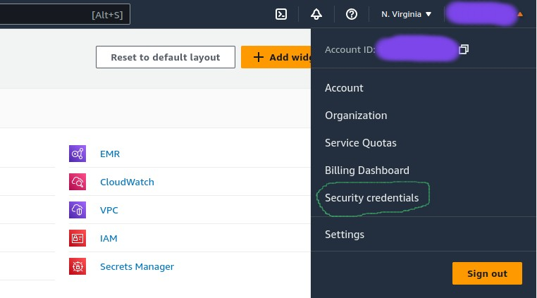

2. Scroll down to Access keys and click on create access key

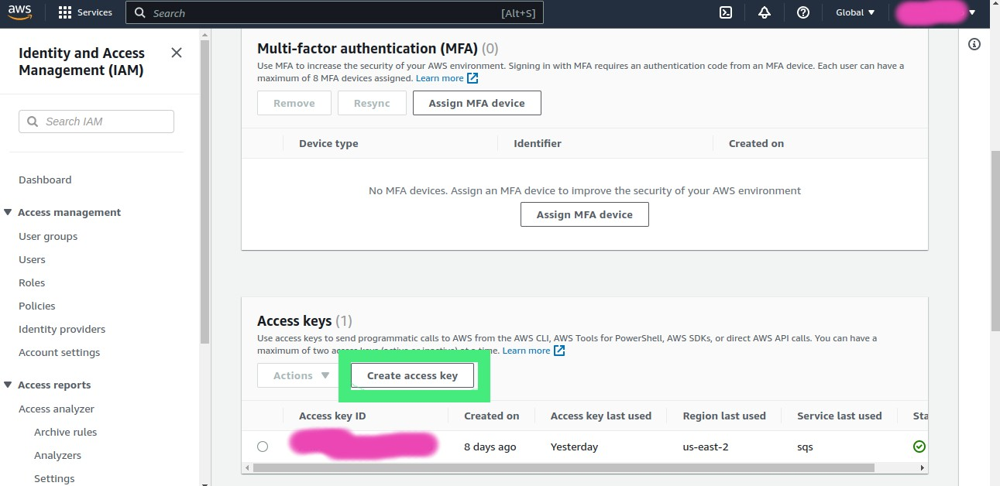

3. Store the secret and acess key somewhere

4. Download and install docker with the commands below

    1.  sudo apt-get update
    2.  sudo apt-get install docker-ce docker-ce-cli containerd.io docker-buildx-plugin docker-compose-plugin

5. test the installation executing

    1. sudo docker run hello-world

6. For reference, those commands come from here

    1.  https://docs.docker.com/engine/install/ubuntu/

7. Download the aws-cli

    1.  curl "https://awscli.amazonaws.com/awscli-exe-linux-x86_64.zip" -o "awscliv2.zip"
    2.  unzip awscliv2.zip
    3.  sudo ./aws/install

8. For refence, the aws cli commands comes from here

    1.  https://docs.aws.amazon.com/cli/latest/userguide/getting-started-install.html

9.  Download the airflow yaml docker compose file into the airflow/containers folder, create the necessary folders , create a requested variable and initialize the containers

    1. cd airflow/containers && curl -LfO 'https://airflow.apache.org/docs/apache-airflow/2.6.2/docker-compose.yaml'
    2. mkdir -p ./dags ./logs ./plugins ./config
    3. echo -e "AIRFLOW_UID=$(id -u)" > .env
    4. docker compose up airflow-init

10. After initialization is complete, you should see a message like this

    airflow-init_1       | Upgrades done
    airflow-init_1       | Admin user airflow created
    airflow-init_1       | 2.6.2
    start_airflow-init_1 exited with code 0

11. Create enviroment variables in your local machine using the access_key and secret_key

    1.  export AWS_ACCESS_KEY_ID=_______________
    2.  export AWS_SECRET_ACCESS_KEY=___________
    3.  export AWS_DEFAULT_REGION=_______________

12. Create the ECR service and push docker image to the ECR repository you will find the commands in the "push command" button

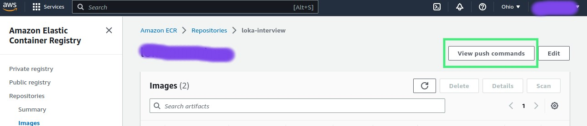

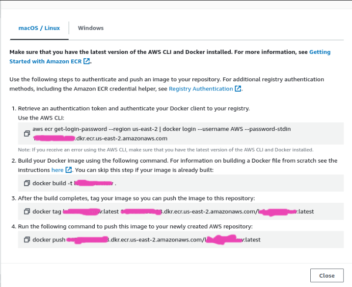

13. Create the lambda function from a container

14. Click in configurations and increase the Timeout to 13 min, and add the enviroment variables

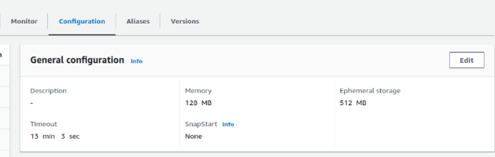

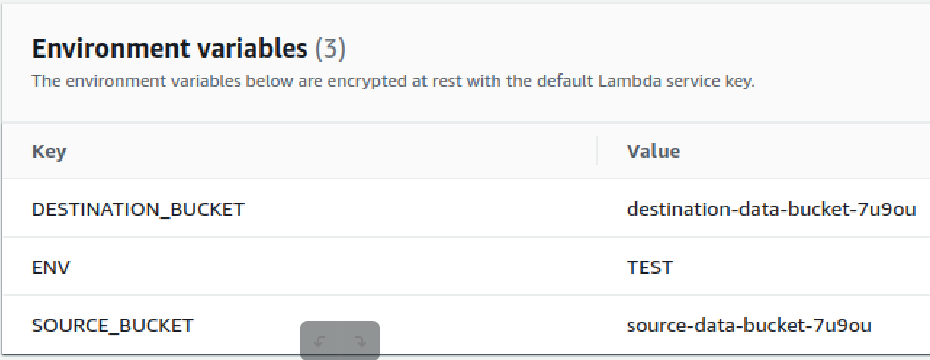

15. Create a sqs queue an create a trigger for the lambda function using the sqs queue

16. go to the airflow folder airflow/containers and execute docker compose up

17. it take some minutes to start the airflow docker containers, once they are ready open localhost:8080 in the web browser, user should be airflow and password airflow

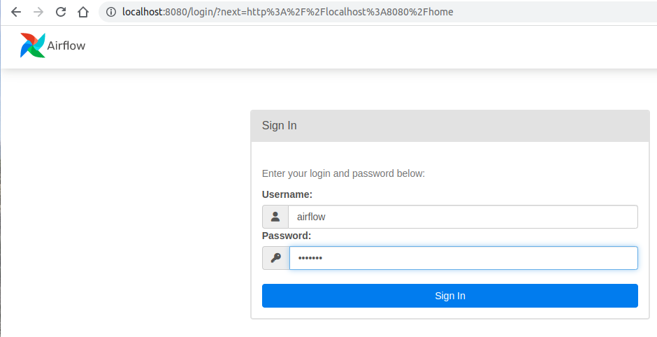

  ENV = TEST
  QueueUrl = The AWS SQS Queue Url
  AWS_ACCESS_KEY_ID = The AWS AWS ACCESS KEY ID
  AWS_SECRET_ACCESS_KEY = The AWS SECRET ACCESS KEY
 
18. Set the airflow enviromental variables 

19. look for the demo_dag

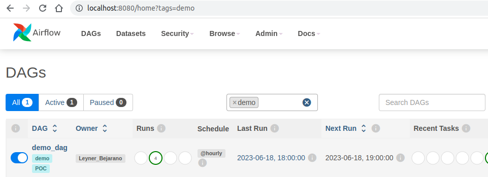

20. All of the data for this demo is from 2019-06-01-15-#-#-events.json so will click on the arrow symbol, and select "Trigger w config"

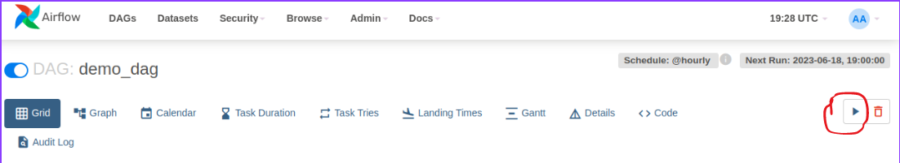


21. Choose 2019-06-01T15:00:00+00:00 in the date picker and then press the Trigger button

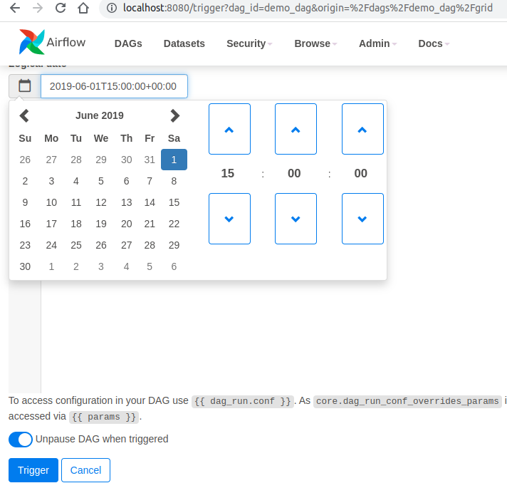

22. That should put some messages in the AWS sqs service

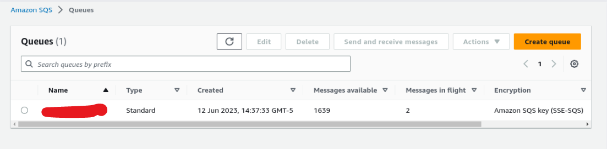

23. Finally, once the Airflow execution finish, you should see the files in avro format in the destination bucket

24. For creating the snowflake tables, we will need to create a AWS IAM role, assing permissions to the destination bucket

25. Now, create the database and the storage integration with the iam role arn

~~~~sql
CREATE DATABASE IF NOT EXISTS demo_db;

USE DATABASE demo_db;


CREATE STORAGE INTEGRATION demo_storage_integration
  TYPE = EXTERNAL_STAGE
  STORAGE_PROVIDER = 'S3'
  ENABLED = TRUE
  STORAGE_AWS_ROLE_ARN = 'arn:aws:iam::____________'
  STORAGE_ALLOWED_LOCATIONS = ('s3://_____________');
~~~~

26. Describe the storage integration, remember the STORAGE_AWS_IAM_USER_ARN and the STORAGE_AWS_EXTERNAL_ID. After that, change the Trust relationships for the iam role we created with something like the json below

```json
{
  "Version": "2012-10-17",
  "Statement": [
    {
      "Sid": "",
      "Effect": "Allow",
      "Principal": {
        "AWS": "<snowflake_user_arn>"
      },
      "Action": "sts:AssumeRole",
      "Condition": {
        "StringEquals": {
          "sts:ExternalId": "<snowflake_external_id>"
        }
      }
    }
  ]
}
```

27. Create the snowflake stage

~~~~sql
CREATE STAGE IF NOT EXISTS demo_stage_s3
    STORAGE_INTEGRATION = demo_storage_integration
    FILE_FORMAT = ( TYPE =AVRO ) 
    URL='s3://______';
~~~~

28. Test the stage using the command below

~~~~sql
SELECT metadata$filename FROM @demo_stage_s3/;
~~~~

29. Finally, create the external table 

~~~~sql
CREATE EXTERNAL TABLE demo_ext_table(
  date_part date as to_date(SUBSTR(split_part(metadata$filename,'/',6), 1, 10), 'YYYY-MM-DD'),
  on_part varchar as split_part(metadata$filename,'/',2),
  event varchar AS (value:event::varchar),
  "on" varchar AS (value:"on"::varchar),
  "at" varchar AS (value:"at"::varchar),
  organization_id varchar AS (value:organization_id::varchar),
  id varchar AS (value:id::varchar),
  lat float AS (value:lat::float),
  lng float AS (value:lng::float),
  "start" varchar AS (value:"start"::varchar),
  finish varchar AS (value:finish::varchar))
  PARTITION BY (on_part, date_part)
  LOCATION=@demo_stage_s3
  AUTO_REFRESH = true
  FILE_FORMAT = (TYPE = AVRO);
~~~~

30. For reference regarding connecting a external table to snowflake see this link https://docs.snowflake.com/en/user-guide/data-load-s3-config-storage-integration


## How does it work

### The ETL

The system starts with the ETL. The ETl are the four python classes you can find in the files of the foulder extraction/models.

The ExtractionMapping class that you can find in the extraction/models/ExtractionMapping.py. When you call the ____init____ it is expecting the filename of a file in the source s3.

Calling the  ____init____ function will also execute the extract function. The extract function will use the boto3 to extract the data from filename in s3.

The next step in the ___init___ function is to define the distint "on" values in the json. One we have extracted the data in the ExtractionMapping we call the TransformationMapping for doing transformation and load.

The class TransformationMapping is a facade for its subclasses. When we create an instane of the TransformationMapping, that call the ___new___ function that returns the subclass that we need depending on the "on" value

This allow to add more transformations to the TransformationMapping without needing to change the ExtractionMapping class.

In the subclasses of  TransformationMapping we have only what is specific to them, the transformation, and the load function is the same for both subclasses.

For executing the whole ETL you only need to pass the filename of the json in the source bucket to the ExtractionMapping, that is what we are doing in the handler of the lambda_function.

We are using sqs as the trigger so you could receive one or many events from the sqs depending on how you configure the sqs, that is why we have the for loop in there.

### The Scheduler

This process is supposed to be executed in a hourly schedule, this mean we could handle it with a batch process (if we needed to receive data more often like every 5 minutes would mean that we need a streaming system like kafka).

The dag that you can find in airflow/containers/dags/demo_dag.py is scheduling the execution of the file in lambdaExecutor.py.

We have several files to make it eaier to evolve the system. With lambdaExecutor.py operating as the main layer, what we call from the airflow DAG, a bussiness logic layer in the file lambdaExecutorBL.py that we execute from the main layer and a utility layer.

Files in the source bucket have a names of the type 2019-06-01-15-#-#-events.json, so in the execution of 2019-06-01-T15 we need to create events for the lambda for the 60 seconds of the 60 minutes of the hour 15.

Doing this with the threading library make it way faster than doing it in a sequential way. Even though this is a batch process and we dont usually need to see results in a instantaneous way, succeding or failing as fast as possible allow us to have a better debugging process

### Creating tables

Once the DAG finish we'll have a queue of executions that the lambda function will handle having as the end result avro files in different folders that we will call partitions.

When we are doing analitycs, we have several differences to transacctional systems the two most important are the amount of data we have to deal with and the second is he access pattern.

For doing analitycs we need a specialized database system, I'll go with snowflake.

we already have data in the destination bucket, so, at the beggining we woll only query the data without replicating it. Most databases engines for analitycs have external table where tables are just a desription of the underlying data that we have in other place.

External tables are not as fast as internal table, so for doing analitycs we will create internal tables.


## RoadMap

1. compress files in s3 using gzip

2. compact files in s3 using hive (recommended file size in snowflake is 16 - 256 MB)
  1.  https://docs.snowflake.com/en/user-guide/tables-external-intro  

3. Create facts table with surrogate keys

4. Create the organization dimension table and the time dimension table with surrogate keys

5. Create airflow sla-miss  implementation 
  1.  sla-miss from airflow is pretty problematic, will nee our own
  2.  detect DAGs that are running longer than they should without failing or succeding

6. Create on_failure and on_success callbacks for airflow

7. In sqs implement dead_letter

8. aws sam for lambda local_debugging

9. terraform For IAC

10. implement secret_manager

11. use query_history in snowflake for bulding the data_lineage system

12. use explain command for checking perfomance issues, like tables not been prunned

13. For testing coverage test and checking conventions using linters